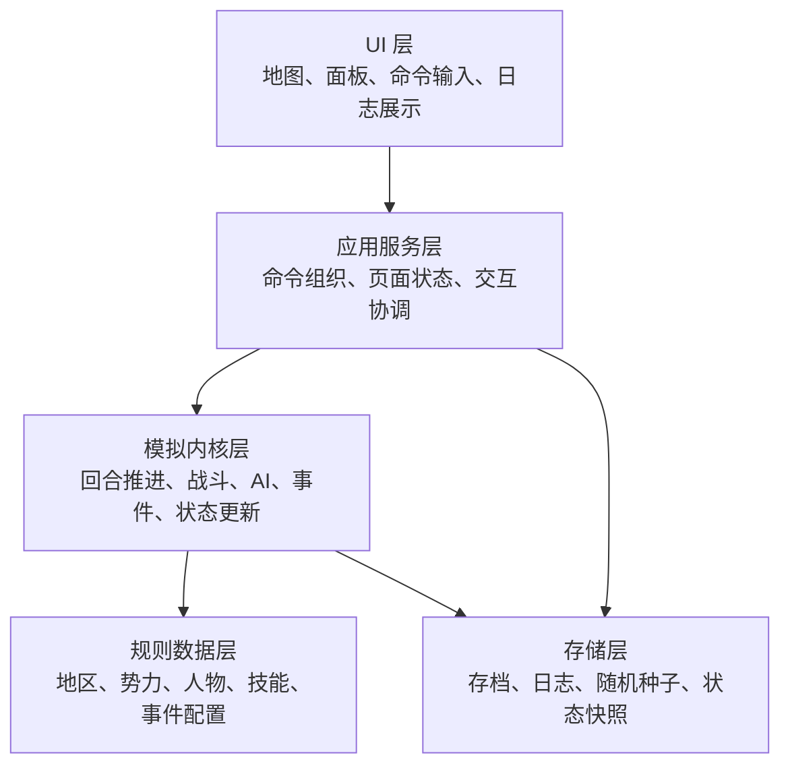
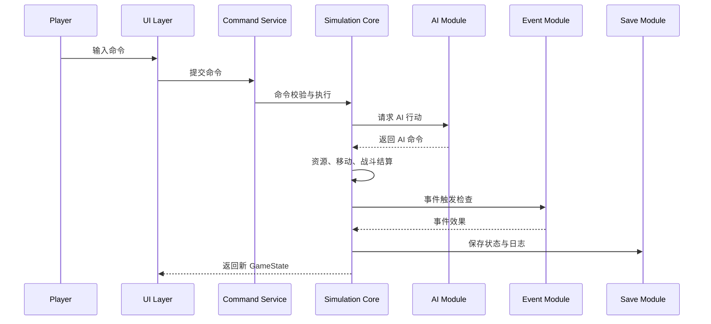
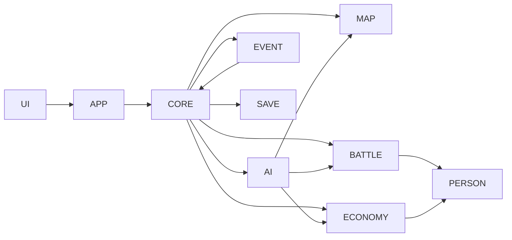

# 系统架构与数据设计说明

## 一、总体架构

HistorySim Lite 采用分层架构。系统由 UI 层、应用服务层、模拟内核层、规则数据层和存储层组成。

核心原则为：**模拟内核不依赖 UI，UI 只读取状态并提交命令**。

## 二、模块划分

| 模块 | 英文名 | 职责 |
|---|---|---|
| 核心状态模块 | core | 定义 GameState、回合流程、命令校验 |
| 地图模块 | map | 管理地区、邻接图、路径搜索 |
| 势力模块 | faction | 管理势力资源、外交状态和控制区域 |
| 人物模块 | person | 管理人物属性、忠诚、技能和任命 |
| 经济模块 | economy | 处理开发、征兵、资源增长 |
| 战斗模块 | battle | 计算战斗结果、伤亡和地区归属 |
| AI 模块 | ai | 生成候选行动、计算评分、选择行动 |
| 事件模块 | event | 判断触发条件并执行事件效果 |
| 存档模块 | save | 保存和读取 GameState、日志和随机种子 |
| 界面模块 | ui | 展示地图、面板、命令和日志 |

## 三、核心数据流

## 四、主要数据实体

### 1. Region

| 字段 | 类型 | 说明 |
|---|---|---|
| region_id | string | 地区唯一标识 |
| name | string | 地区名称 |
| owner_faction_id | string | 所属势力 |
| terrain | enum | 地形类型 |
| population | number | 人口 |
| agriculture | number | 农业 |
| commerce | number | 商业 |
| public_order | number | 治安 |
| defence | number | 城防 |
| troops | number | 驻军 |
| food | number | 粮草 |
| neighbours | string[] | 相邻地区 |

地形类型固定为：plain、mountain、river、coast、forest。

### 2. Faction

| 字段 | 类型 | 说明 |
|---|---|---|
| faction_id | string | 势力唯一标识 |
| name | string | 势力名称 |
| ruler_person_id | string | 君主人物 ID |
| colour | string | 地图显示颜色 |
| capital_region_id | string | 首府地区 |
| gold | number | 金钱 |
| food | number | 粮草 |
| prestige | number | 威望 |
| ai_controlled | boolean | 是否由 AI 控制 |

### 3. Person

| 字段 | 类型 | 说明 |
|---|---|---|
| person_id | string | 人物唯一标识 |
| name | string | 人物名称 |
| faction_id | string | 所属势力 |
| location_region_id | string | 所在地区 |
| age | number | 年龄 |
| status | enum | active、captured、dead、retired |
| command | number | 统率 |
| strength | number | 武力 |
| intelligence | number | 智力 |
| politics | number | 政治 |
| charisma | number | 魅力 |
| loyalty | number | 忠诚 |
| ambition | number | 野心 |
| skill_ids | string[] | 技能列表 |

### 4. Army

| 字段 | 类型 | 说明 |
|---|---|---|
| army_id | string | 军队唯一标识 |
| faction_id | string | 所属势力 |
| location_region_id | string | 所在地区 |
| leader_person_id | string | 主将 |
| troops | number | 兵力 |
| morale | number | 士气 |
| status | enum | stationed、moving、fighting、retreating |

### 5. Skill

| 字段 | 类型 | 说明 |
|---|---|---|
| skill_id | string | 技能唯一标识 |
| name | string | 技能名称 |
| type | enum | passive、active |
| scope | enum | region、battle、faction、ai |
| description | string | 技能说明 |
| effect_type | string | 效果类型 |
| effect_value | number | 效果数值 |

### 6. Event

| 字段 | 类型 | 说明 |
|---|---|---|
| event_id | string | 事件唯一标识 |
| name | string | 事件名称 |
| category | enum | historical、random、system |
| trigger_condition | object | 触发条件 |
| effect | object | 事件效果 |
| log_template | string | 日志文本模板 |

### 7. GameState

GameState 是系统运行时的中心状态对象。所有回合推进、命令执行、AI 决策、战斗结算和事件触发均围绕 GameState 展开。

GameState 至少包含：

| 字段 | 说明 |
|---|---|
| turn | 当前回合数 |
| date | 游戏内日期 |
| random_seed | 当前随机种子 |
| regions | 地区集合 |
| factions | 势力集合 |
| persons | 人物集合 |
| armies | 军队集合 |
| turn_logs | 回合日志 |
| pending_commands | 待执行命令 |

## 五、主要界面设计

系统应包含 4 组主要界面或面板：

| 界面 | 功能 |
|---|---|
| Map View | 显示地区、势力颜色、军队图标和地区状态 |
| Region and Faction Panel | 查看地区和势力详情 |
| Person and Appointment Panel | 查看人物、排序人物、执行任命 |
| Turn Log and Save Panel | 推进回合、查看日志、保存和读取 |

## 六、架构约束

1. UI 层不得直接修改 GameState；
2. AI 模块不得直接依赖具体 UI 组件；
3. 战斗公式不得写入地图渲染逻辑；
4. 事件触发不得散落在多个业务流程中；
5. 随机数生成必须集中管理；
6. 所有核心算法应具备独立测试入口；
7. 关键状态变化必须写入日志。

## 七、模块依赖关系

架构评价时应重点检查依赖是否清晰、核心模块是否可单独测试、规则是否具备扩展空间。
