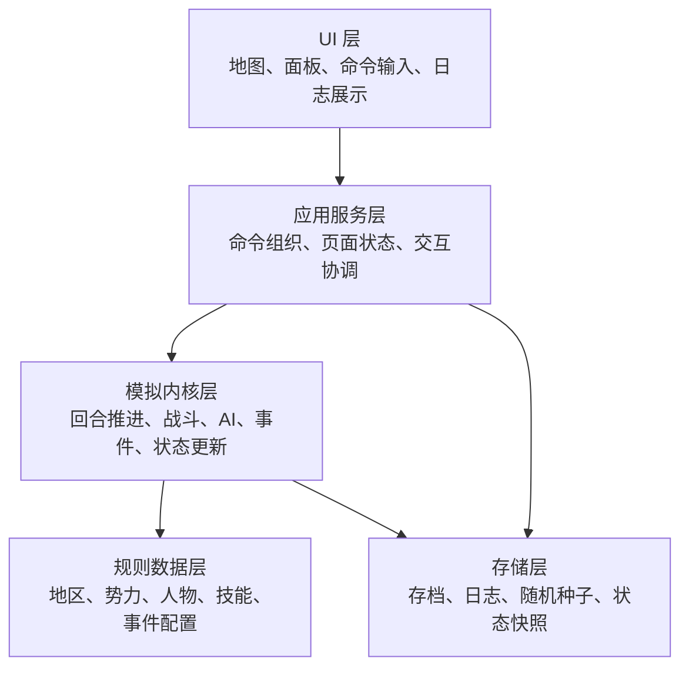
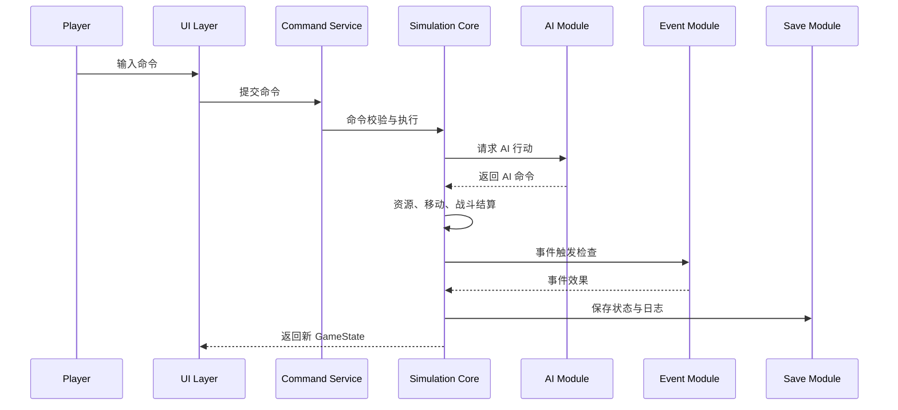

# 《算法与软件架构》（2025-2026-2）项目制教学规划

## 一、课程案例名称

**HistorySim Lite：历史策略模拟系统**

**HistorySim Lite: A Historical Strategy Simulation System**

## 二、案例定位

HistorySim Lite 是《算法与软件架构》课程的贯穿式项目案例。尽管该案例不以商业游戏制作为目标，学生仍需要围绕一个简化的历史模拟世界，完成地图图模型、角色和势力数据、回合推进、命令执行、战斗结算、AI 决策、事件触发、存档和基础 UI 展示等功能。

强调以下能力培养：

1. 将复杂现实问题抽象为数据结构、对象模型和模块边界；
2. 在真实业务场景中选择并实现合适的算法；
3. 使用分层架构组织复杂功能；
4. 通过测试、日志和文档保障系统可维护性；
5. 在小组协作中完成需求分析、设计、实现、验证和展示。

## 三、教学目标

完成本案例后，学生应能够：

1. 使用图结构表示地区之间的连接关系，并实现可达性查询和最短路径计算；
2. 使用排序、评分函数和优先级规则实现角色选择、城市价值评估和 AI 行动选择；
3. 设计以 GameState 为中心的状态模型，并实现可复现的回合推进；
4. 将战斗、内政、事件和 AI 决策拆分为可测试的独立模块；
5. 说明软件架构中的分层、模块化、接口、依赖方向和数据驱动设计；
6. 编写项目需求说明、架构设计、算法说明、测试报告和用户说明；
7. 通过 Git 记录、测试用例和答辩展示体现工程实践能力。

## 四、统一项目规模

为保持课程实施、作业验收和评分的一致性，本案例采用以下统一规模：

| 项目元素 | 标准规模 |
|---|---:|
| 地区（Region） | 30 个 |
| 势力（Faction） | 4 个 |
| 历史人物（Person） | 50 个 |
| 技能（Skill） | 20 个 |
| 事件（Event） | 10 个 |
| 基础命令（Command） | 5 类 |
| 核心算法组 | 5 组 |
| 主要界面/面板 | 4 组 |
| 教学实施单元 | 16 次，每次 90 分钟 |

基础命令固定为：开发（DEVELOP）、征兵（RECRUIT）、移动（MOVE_ARMY）、攻击（ATTACK）、任命（APPOINT）。

核心算法组固定为：地图图模型与路径搜索、排序与优先级评估、资源增长与状态更新、战斗结算、AI 效用评分与行动选择。

## 五、课程主线

课程主线分为四个阶段：

| 阶段 | 名称 | 教学重点 | 形成成果 |
|---|---|---|---|
| 第一阶段 | 问题建模 | 领域对象、数据结构、地图图模型 | 领域模型与基础数据 |
| 第二阶段 | 算法实现 | 路径搜索、资源增长、战斗结算、AI 评分 | 可运行模拟内核 |
| 第三阶段 | 架构组织 | 分层、模块化、事件、存档、测试 | 可维护系统架构 |
| 第四阶段 | 综合交付 | UI、集成、测试、答辩 | 完整项目成果 |

## 知识点映射

HistorySim Lite 是《算法与软件架构》课程的综合案例。课程中的算法知识点应在项目中形成可运行、可解释、可测试的功能；软件架构知识点应在项目中形成清晰的模块、接口、依赖关系和文档。

### 算法知识点

| 算法知识点 | 项目任务 | 产出要求 |
|---|---|---|
| 图结构 | 将 30 个地区建模为 Region Graph | 地区邻接表、连通性检查 |
| BFS | 查询若干步内可达地区 | 可达性测试用例 |
| Dijkstra | 计算带地形成本的最低成本路径 | 路径结果和复杂度说明 |
| 排序 | 对人物、地区、攻击目标进行排序 | 角色排序、城市价值排名 |
| 贪心策略 | AI 优先选择高收益行动 | AI 行动评分表 |
| 评分函数 | 评估城市价值、攻击收益和防守风险 | AI 评分公式说明 |
| 状态更新 | 按回合更新资源、人口、治安、兵力 | 回合推进测试 |
| 随机模拟 | 战斗和事件中加入可控随机性 | 固定随机种子复现测试 |
| 边界条件 | 防止负数资源、无效路径、非法攻击 | 边界测试用例 |
| 复杂度分析 | 分析地图规模和 AI 候选行动数量对性能的影响 | ALGORITHMS.md 中说明 |

### 软件架构知识点

| 架构知识点 | 项目任务 | 产出要求 |
|---|---|---|
| 分层架构 | 区分 UI 层、应用服务层、模拟内核、数据层 | 架构图和模块说明 |
| 模块化 | 拆分 map、person、economy、battle、ai、event、save | 模块职责表 |
| 依赖方向 | UI 依赖状态展示，模拟内核不依赖 UI | 依赖关系说明 |
| 数据驱动 | 使用配置数据描述人物、地区、技能和事件 | 数据字典 |
| 规则封装 | 将战斗公式、资源增长和 AI 评分独立封装 | 公式说明和测试 |
| 事件驱动 | 通过 Event 表达系统状态变化 | 事件触发流程 |
| 可测试架构 | 核心算法可脱离界面单独测试 | 单元测试报告 |
| 持久化 | 保存 GameState、随机种子和日志 | 存档设计说明 |
| 日志设计 | 记录命令、AI、战斗、事件和资源变化 | 回合日志样例 |
| 重构意识 | 从可运行版本过渡到模块清晰版本 | 重构说明和提交记录 |

### 与课程学习成果的对应

| 学习成果 | 项目体现 |
|---|---|
| 能够分析复杂软件问题 | 将历史模拟系统拆解为数据、规则、算法和界面 |
| 能够选择合适算法 | 对路径、排序、战斗、AI 选择不同算法方案 |
| 能够说明算法复杂度 | 对地图搜索、AI 候选生成和事件扫描进行分析 |
| 能够设计软件架构 | 形成分层、模块化、可测试的系统结构 |
| 能够进行工程实现 | 使用 Git、测试、文档和演示完成项目闭环 |
| 能够进行技术表达 | 在答辩中说明需求、设计、算法、测试和权衡 |

## 系统架构

HistorySim Lite 采用分层架构。系统由 UI 层、应用服务层、模拟内核层、规则数据层和存储层组成。



核心原则为：**模拟内核不依赖 UI，UI 只读取状态并提交命令**。

## 模块划分

| 模块 | 英文名 | 职责 |
|---|---|---|
| 核心状态模块 | core | 定义 GameState、回合流程、命令校验 |
| 地图模块 | map | 管理地区、邻接图、路径搜索 |
| 势力模块 | faction | 管理势力资源、外交状态和控制区域 |
| 人物模块 | person | 管理人物属性、忠诚、技能和任命 |
| 经济模块 | economy | 处理开发、征兵、资源增长 |
| 战斗模块 | battle | 计算战斗结果、伤亡和地区归属 |
| AI 模块 | ai | 生成候选行动、计算评分、选择行动 |
| 事件模块 | event | 判断触发条件并执行事件效果 |
| 存档模块 | save | 保存和读取 GameState、日志和随机种子 |
| 界面模块 | ui | 展示地图、面板、命令和日志 |

## 核心数据流



## 最终提交目录建议

```text
HistorySim-Lite/
├── README.md
├── data/
│   ├── regions.*
│   ├── factions.*
│   ├── persons.*
│   ├── skills.*
│   └── events.*
├── src/
├── tests/
├── docs/
│   ├── SRS.md
│   ├── ARCHITECTURE.md
│   ├── ALGORITHMS.md
│   ├── TEST_REPORT.md
│   ├── USER_MANUAL.md
│   └── CONTRIBUTION.md
└── presentation/
    └── final-presentation.*
```

文件格式可根据技术栈调整，但文档名称和职责应保持一致。
